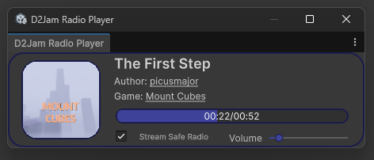

# Down2Jam For Unity


## About
A Unity Package to use the Down2Jam API into you jam entries.

## Features

### Easy to use APIs for Login, Leaderboard, Achievemvents and more

<br>

Login
```csharp
// Coming soon
```

Achievements
```csharp
// Coming soon
```

Leaderboard
```csharp
// Coming soon
```

Image Upload
```csharp
// Coming soon
```

Audio Download
```csharp
// Coming soon
```

Image Download
```csharp
// Coming soon
```

### In-engine D2Jam official radio



*It auto-close when you enter playmode :D*

----


## Dependency
- [UniTask](https://github.com/Cysharp/UniTask/tree/master#getting-started): Provides an efficient allocation free async/await integration for Unity.

## How to install

### Using **Unity Package Manager**
- Open the Unity Package Manager  
- Click on `+` icon 
- Select `Install Package from git URL...` 
- Paste `https://github.com/R4ndomThunder/Down2Jam4Unity.git` 
- Click `Install`
- Wait & Enjoy! :D

### Using **manifest.json**
- Open your `Packages/manifest.json` file
- Add this line to it
```json 
"dev.samuelepadalino.down2jam4unity": "https://github.com/R4ndomThunder/Down2Jam4Unity.git"
```
- Save the file
- Wait & Enjoy! :D

## You are not using Unity?

- ### [Temptic404](https://www.twitch.tv/temptic404) made it for Godot! [Down2JamGodot](https://github.com/Temptica/Down2JamGodot)
